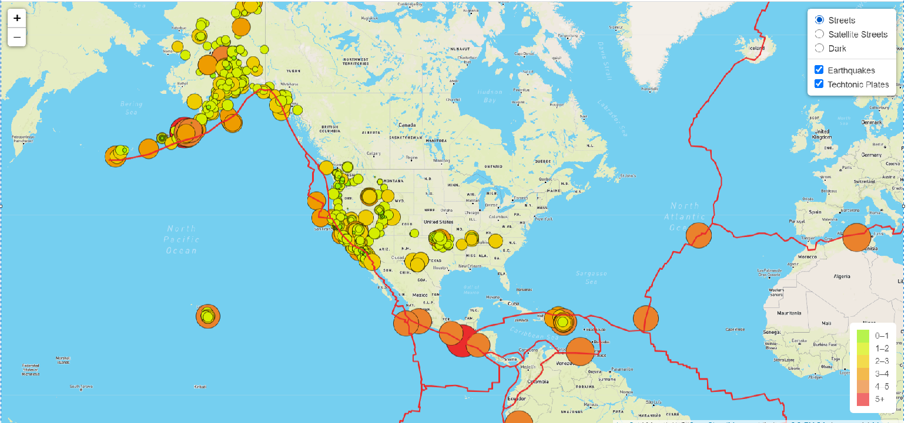
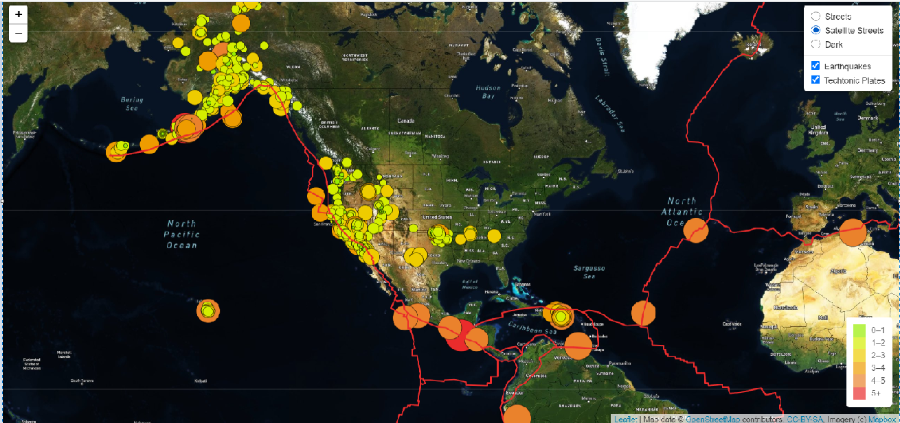
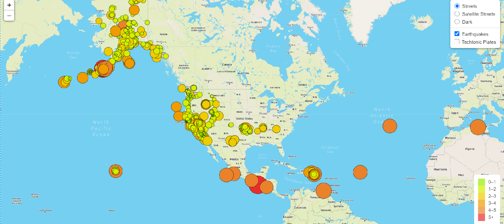
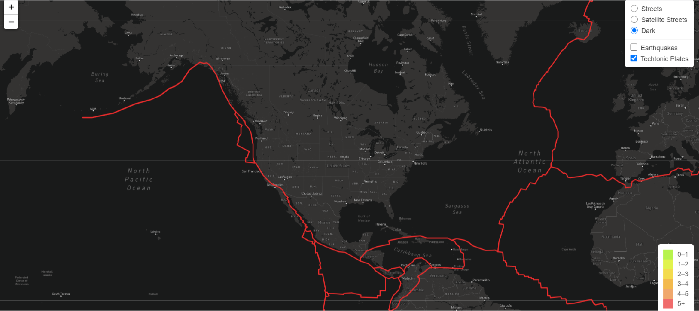

# Mapping Earthquakes Summary
The goal of this project is to show earthquakes all around the world and display then in different colors according to their magnitude. Also user can see techtonics plates. This project shows map in three different style and user will be able to select the style. 
### Technology used
To achive above goal we have used geoJSON, JavaScript and HTML combination. To show the techtonic plates we have used GitHub repo.
#### Image street style with Earthquackes and Techtonics Plates
When map loads it will show you street style with earthquakes marked in circle with different colors according to magnitude. Magnitude scale is shown in legdens. 

#### Image Satellie style with Earthquackes and Techtonics Plates

#### Image Dark style with Earthquackes and Techtonics Plates

#### Image with Street view and only Earthquackes

#### Image with Dark view with only Techtonics Plates

